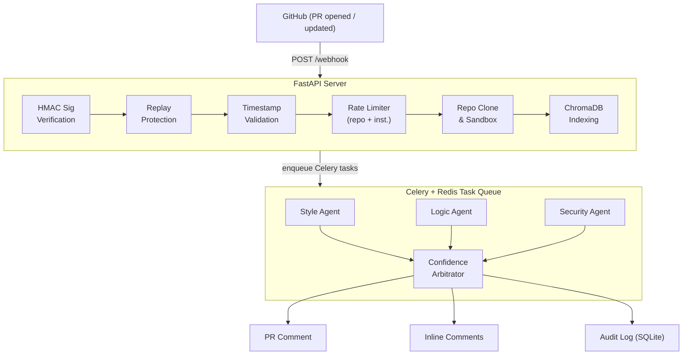

<div align="center">

# 🛡️ PRGuard AI

**Multi-agent pull request review system that catches what humans miss.**

[](https://python.org)
[](https://fastapi.tiangolo.com)
[](https://docs.celeryq.dev)
[](https://docker.com)
[](LICENSE)
[](https://github.com/purvanshh/PRGuard-AI/actions)

</div>

---

PRGuard AI hooks into GitHub via webhooks and runs three independent analysis agents — **Style**, **Logic**, and **Security** — in parallel on every pull request. Each agent combines deterministic rule-based checks with LLM reasoning, then a Confidence Arbitrator aggregates findings, detects inter-agent disagreements, assigns traceable confidence scores, and posts a structured review comment back to the PR. The entire pipeline executes asynchronously through Celery + Redis with retry logic, HMAC signature verification, replay protection, rate limiting, and full audit logging.

---

## Architecture



## Example PR Comment

When PRGuard AI finishes analyzing a pull request, it posts a comment like this:

> ## PRGuard AI Review
>
> **Confidence Score:** 0.74
>
> ### Style
> - `MEDIUM` (line 15): Tab character used for indentation instead of spaces.
> - `LOW` (line 88): Line exceeds 120 characters.
>
> ### Logic
> - `MEDIUM` (line 42): Bare except detected; this can hide runtime errors.
> - `LOW` (line 67): TODO present in newly added code.
>
> ### Security
> - `HIGH` (line 23): Potential SQL injection pattern (string-concatenated query).
> - `HIGH` (line 91): Possible hardcoded secret or API key.
>
> ### Disagreement Summary
> - security reports high-severity issues while style does not.

Medium and high-severity issues also get posted as **inline comments** on the specific lines in the PR diff (up to 10 per review).

## Agent Breakdown

Each agent runs as an independent Celery task on a dedicated queue with automatic retry (`autoretry_for=(Exception,)`, `retry_backoff=True`, `max_retries=1`).

### Style Agent

Checks for consistency with repository conventions using a two-pass approach:

| Pass | Method | What It Catches |
|------|--------|-----------------|
| **Rule-based** | Deterministic string matching | Tab indentation, lines > 120 chars |
| **LLM-guided** | Prompt + repo style examples from ChromaDB | Naming conventions, file structure, docstring consistency |

The style agent retrieves similar code from the repo's ChromaDB index (`repo_indexer.retrieve_similar_code`) to give the LLM actual examples of the project's conventions.

### Logic Agent

Detects logical defects using AST analysis and contextual reasoning:

| Pass | Method | What It Catches |
|------|--------|-----------------|
| **Rule-based** | Pattern matching on added lines | Bare `except:`, unresolved `TODO`s |
| **AST-informed** | `tree-sitter` parse &rarr; function/variable/control-flow summary | Function structure, variable usage, control flow patterns |
| **LLM-guided** | Prompt + AST summary + surrounding context | Off-by-one errors, null handling, boundary conditions, unhandled exceptions |

The logic agent builds an AST summary (`analysis/ast_parser.py`) of changed code and feeds it alongside surrounding context lines to the LLM for deeper reasoning.

### Security Agent

Detects vulnerabilities using both pattern matching and LLM analysis:

| Pass | Method | What It Catches |
|------|--------|-----------------|
| **Rule-based** | Regex/string detection functions | `eval()`/`exec()` usage, SQL injection patterns (string-concatenated queries), hardcoded secrets/API keys |
| **LLM-guided** | Security-focused prompt | Command injection, unsafe deserialization, privilege escalation, SSRF, path traversal |

Each rule-based detection function (`detect_sql_injection`, `detect_eval_usage`, `detect_hardcoded_secrets`) is individually exported and testable.

## Confidence Scoring

Every finding carries a `confidence_source` tag that maps to a numeric weight:

| Source | Weight | Meaning |
|--------|--------|---------|
| `rule_based` | **0.9** | Deterministic pattern match — high certainty |
| `llm_reasoning` | **0.6** | LLM-generated finding — moderate certainty |
| `inferred` | **0.3** | Heuristic or indirect signal — low certainty |

**Per-agent scoring:** An agent's base confidence is blended with the average weight of its issues: `refined = (base_confidence + avg_issue_weight) / 2`, clamped to `[0.0, 1.0]`.

**Aggregate scoring:** Agent scores are averaged, with a +0.1 boost (capped at 1.0) if any high-severity issue exists across all agents — because high-severity findings should increase overall review attention.

**Disagreement detection:** The arbitrator compares severity distributions across agents. If one agent reports high-severity issues and another doesn't, this is flagged in the review.

## Setup

### Prerequisites

- Python 3.11+
- Docker & Docker Compose
- A GitHub account with a repository to monitor
- OpenAI API key

### Docker (Recommended)

```bash
# Clone the repo
git clone https://github.com/purvanshh/PRGuard-AI.git
cd PRGuard-AI

# Configure environment
cp .env.example .env
# Edit .env with your keys (see Environment Variables below)

# Start everything
docker compose up --build
```

This starts three containers:
- **prguard-api** — FastAPI server on port `8000`
- **prguard-worker** — Celery worker processing agent tasks
- **prguard-redis** — Redis 7 as message broker + result backend

### Local Development

```bash
# Clone and install
git clone https://github.com/purvanshh/PRGuard-AI.git
cd PRGuard-AI
python -m venv .venv
source .venv/bin/activate
pip install -r requirements.txt
pip install -e .

# Configure environment
cp .env.example .env
# Edit .env with your keys

# Start Redis (required)
docker run -d -p 6379:6379 redis:7

# Start the Celery worker
celery -A prguard_ai.task_queue.celery_app.celery_app worker --loglevel=INFO --concurrency=1

# In a separate terminal, start the API server
python -m prguard_ai.main
```

The server runs on `http://localhost:8000`.

### Running Tests

```bash
pytest tests/ -v
```

Tests cover diff parsing, agent outputs, scoring engine calculations, and the full pipeline.

## GitHub Webhook Configuration

1. Go to your repository &rarr; **Settings** &rarr; **Webhooks** &rarr; **Add webhook**

2. Configure the webhook:
   | Field | Value |
   |-------|-------|
   | **Payload URL** | `https://your-server.com/webhook` |
   | **Content type** | `application/json` |
   | **Secret** | Same value as `GITHUB_WEBHOOK_SECRET` in your `.env` |
   | **Events** | Select **Pull requests** only |
   | **Active** | ✅ Checked |

3. PRGuard AI responds to these PR actions: `opened`, `synchronize`, `ready_for_review`

4. For local development, use a tunnel like [ngrok](https://ngrok.com):
   ```bash
   ngrok http 8000
   ```
   Then use the generated `https://*.ngrok.io/webhook` URL as your Payload URL.

### GitHub App Authentication (Optional)

PRGuard AI supports GitHub App authentication for fine-grained permissions. Set these additional environment variables:

```env
GITHUB_APP_ID=your_app_id
GITHUB_APP_INSTALLATION_ID=your_installation_id
GITHUB_APP_PRIVATE_KEY=/path/to/private-key.pem  # or inline PEM string
```

The client falls back to `GITHUB_TOKEN` (personal access token) if App auth is not configured.

## Environment Variables

| Variable | Required | Default | Description |
|----------|----------|---------|-------------|
| `OPENAI_API_KEY` | Yes | — | OpenAI API key for LLM-powered analysis |
| `GITHUB_TOKEN` | Yes* | — | GitHub PAT for PR access (fallback if App auth not configured) |
| `GITHUB_WEBHOOK_SECRET` | Yes | — | Shared secret for HMAC signature verification |
| `REDIS_URL` | No | `redis://redis:6379/0` | Redis connection URL for Celery broker |
| `CHROMA_PERSIST_DIR` | No | `.chroma` | Directory for ChromaDB vector index persistence |
| `GITHUB_APP_ID` | No | — | GitHub App ID (for App-based auth) |
| `GITHUB_APP_INSTALLATION_ID` | No | — | GitHub App installation ID |
| `GITHUB_APP_PRIVATE_KEY` | No | — | PEM key string or file path |

*\*Required unless GitHub App auth is configured.*

Reference: [`.env.example`](.env.example)

## API Endpoints

| Method | Endpoint | Description |
|--------|----------|-------------|
| `POST` | `/webhook` | GitHub webhook receiver (HMAC-verified) |
| `GET` | `/review/{pr_id}` | Replay endpoint — returns agent outputs and analysis trace |
| `GET` | `/health` | Extended health check (Redis, DB, OpenAI, queue depths) |
| `GET` | `/metrics` | Prometheus metrics (PRs processed, agent latency, confidence distribution) |
| `WS` | `/stream/{pr_id}` | WebSocket endpoint for live agent progress events |

## Repository Structure

```
prguard-ai/
├── src/
│   └── prguard_ai/          # Installable Python package
│       ├── agents/          # Analysis agents (style, logic, security, arbitrator)
│       ├── analysis/        # Diff parsing, AST analysis, repo indexing, code graph, sandboxing
│       ├── confidence/      # Scoring engine with weighted confidence calibration
│       ├── config/          # Pydantic-based settings (env-driven)
│       ├── cost/            # LLM budget manager and token tracking
│       ├── dashboard/       # Optional web dashboard
│       ├── db/              # Database layer
│       ├── evaluation/      # Evaluation framework with precision/recall metrics
│       ├── github/          # Webhook server, GitHub API client, App auth
│       ├── llm/             # OpenAI client wrapper with token budgeting
│       ├── observability/   # Structured logging, OpenTelemetry tracing, Prometheus metrics, event streaming
│       ├── reliability/     # Reliability patterns (circuit breakers, etc.)
│       ├── schemas/         # Pydantic models (AgentOutput, Issue, PullRequestReport)
│       ├── security/        # Rate limiter (per-repo + per-installation)
│       └── task_queue/      # Celery app, task definitions, task registry, Redis client
├── deploy/                  # Production docker-compose + Prometheus config
├── docs/                    # Architecture docs, example reviews, runbook
├── fixtures/                # Test fixtures and sample data
├── prompts/                 # Agent prompt templates (style, logic, security)
├── scripts/                 # Utility scripts
├── tests/                   # Unit and integration tests
├── .github/workflows/       # CI/CD pipeline (GitHub Actions)
├── Dockerfile               # Python 3.11-slim container image
├── docker-compose.yml       # Multi-service orchestration (API + worker + Redis)
├── pyproject.toml           # Project metadata and packaging config
├── requirements.txt         # Python dependencies
└── .env.example             # Environment variable template
```

## Evaluation Methodology

PRGuard AI includes an evaluation framework (`evaluation/evaluator.py`) that benchmarks agent accuracy against labeled datasets:

1. **Dataset**: Hand-annotated PR diffs in `evaluation/dataset/` with expected issues (line number + message pairs)
2. **Pipeline**: Each diff is run through all three agents &rarr; arbitrator &rarr; produces detected issue set
3. **Metrics**: Standard information-retrieval metrics computed against the expected set:
   - **True Positives** — correctly detected issues
   - **False Positives** — spurious findings
   - **Missed Issues** — expected issues not caught
   - **Precision** — `TP / (TP + FP)`
   - **Recall** — `TP / (TP + FN)`
   - **Confidence** — arbitrator's aggregated confidence score

Run evaluation:
```bash
python -c "from prguard_ai.evaluation.evaluator import evaluate_pr; print(evaluate_pr(open('evaluation/dataset/example_1.json').read()))"
```

## Security Measures

- **HMAC-SHA256 verification** on every webhook payload
- **Replay protection** via `X-GitHub-Delivery` deduplication (Redis-backed, 5-min TTL)
- **Timestamp validation** rejecting requests older than 2 minutes
- **Payload size limit** of 5 MB
- **Rate limiting** per repository and per GitHub App installation
- **Global concurrency control** preventing worker saturation
- **Sandboxed repo clones** with cleanup on completion
- **No secrets in logs** — structured logging with sanitized output

## Roadmap

- [ ] **Multi-language support** — extend tree-sitter parsing beyond Python (Go, TypeScript, Rust)
- [ ] **Custom rule configuration** — per-repo `.prguard.yml` for tuning agent thresholds
- [ ] **GitHub App Marketplace listing** — one-click install for any repository
- [ ] **PR review suggestions** — use GitHub's suggestion API for auto-fixable issues
- [ ] **Fine-tuned models** — domain-specific fine-tuning on labeled PR review data
- [ ] **Incremental review** — only re-analyze changed files on `synchronize` events
- [ ] **Dashboard v2** — real-time review progress, historical analytics, cost tracking
- [ ] **Slack/Discord notifications** — alert channels on high-severity findings
- [ ] **Self-hosted LLM support** — Ollama/vLLM backends for air-gapped deployments

## Contributing

See [CONTRIBUTING.md](CONTRIBUTING.md) for guidelines.

## License

[MIT](LICENSE)

---

<div align="center">

Built by [Purvansh Sahu](https://github.com/purvanshh) · 3rd Year CS @ Scaler School of Technology + BITS Pilani · ML Research Intern @ IIT Madras

</div>
